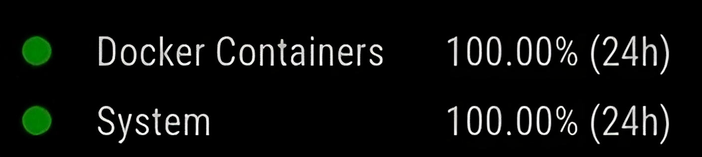
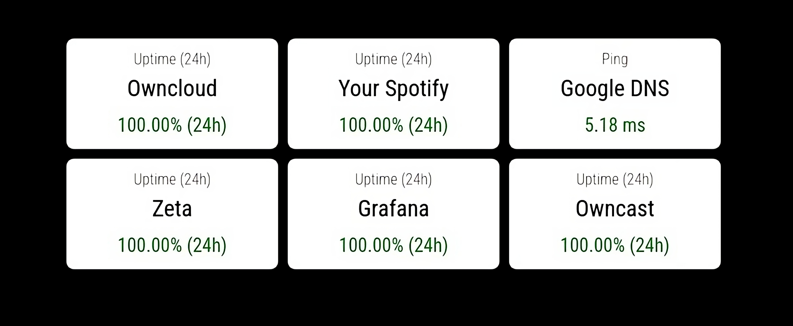

# MMM-AuthenticatedUptimeKuma
A module for displaying uptime kuma status. This does not require a status page and uses your authentication to fetch the data from the socket. There are two display types:

### List


### Widget



## Installation

Navigate to the MagicMirror's Module folder:

```bash
cd ~/MagicMirror/modules
```

Clone this repository:

```bash
git clone https://github.com/totoluto/MMM-AuthenticatedUptimeKuma.git
```

Configure the module in your `config.js` file.

## Using the module
To use this module, add the configuration to the modules array in `config/config.js` file:

```js
{
	module: "MMM-AuthenticatedUptimeKuma",
	position: "bottom_right",
	config: {
		url: "https://your-url.com",
		token: "your-socket-token",
		displayType: "widget",
        widgetSettings: {
			titleColor: "black",
			backgroundColor: "#FFFFFF",
			descriptionColor: "#666",
			minWidth: "200px"
		},
		monitors: [
    		{
        		id: 3,
        		name: "Docker Containers",
        		display: "uptime24",       
 			},
			{
        		id: 1,
        		name: "System",
        		display: "uptime24",
    		},
        ]
	}
		
}
```

## Configuration Options


| Option | Default | Description |
|-----|-----|-----|
| `url` | `""` | URL/IP of your Uptime-Kuma instance |
| `token` | `""` | Socket Token used to log into the Uptime-Kuma instance. You can use [totoluto/UptimeKuma-Token-Generator](https://github.com/totoluto/UptimeKuma-Token-Generator) to generate a token. |
| `displayType` | `"list"` | This specifies how the module is shown. There are two valid options: `list`, `widget` |
| `widgetSettings` | | In here there are all the settings which will be applied to the widget. If you only want to use the list, then you don't need to specify this option. |
| `widgetSettings.titleColor` | `"black"` | The color of the Widget Titel. Any HTML color is allowed or an hex value. |
| `widgetSettings.backgroundColor` | `"#FFFFFF"` | The background color of the widget. Any HTML color is allowed or an hex value. |
| `widgetSettings.descriptionColor` | `"#666"` | This is the desciption color which let's you know what you are displaying. Any HTML color is allowed or an hex value. |
| `widgetSettings.minWidth` | `200px` | The min with of the widget itself. Can be any CSS option for dimensions. |
| `monitors` | `[]` | In here all the monitors which you want to display are listed and configured. By default the array is empty and you need to add your monitors.
| `monitors[XY].id` | | Enter the ID of your monitor which should be displayed.
| `monitors[XY].name` | | A Descriptive Name for your monitor.
| `monitors[XY].display` | | Specify what you want to show on your widget/list. There are several types: <ul><li>`ping` shows the current ping of your monitor.</li><li>`avgPing` shows the average ping (past 24 hours) of your monitor.</li>`uptime24` shows the uptime in the past 24 hours in %</li><li>`uptime30` shows the uptime in the past 30 days in %</li></ul>


## Find Monitor IDs

You can get your monitor ID by clicking on the Monitor on your Web-Instance and then you can check the ID in the URL.

```
https://your-url.com/dashboard/[ID]
```
